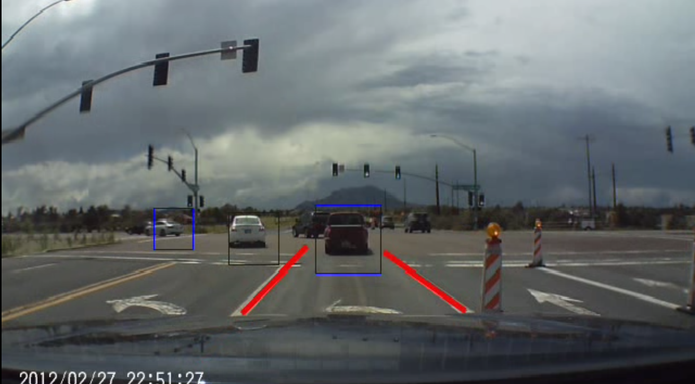
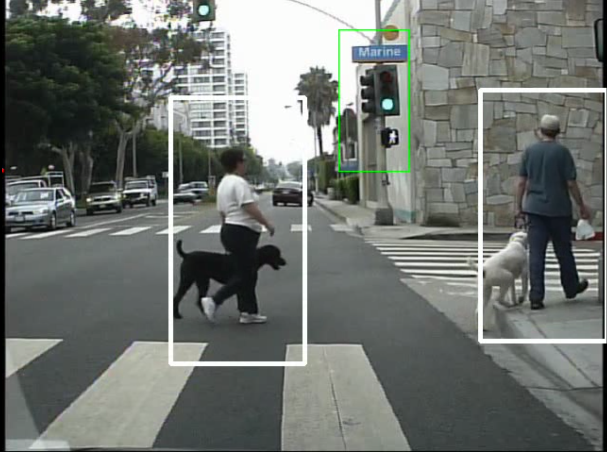
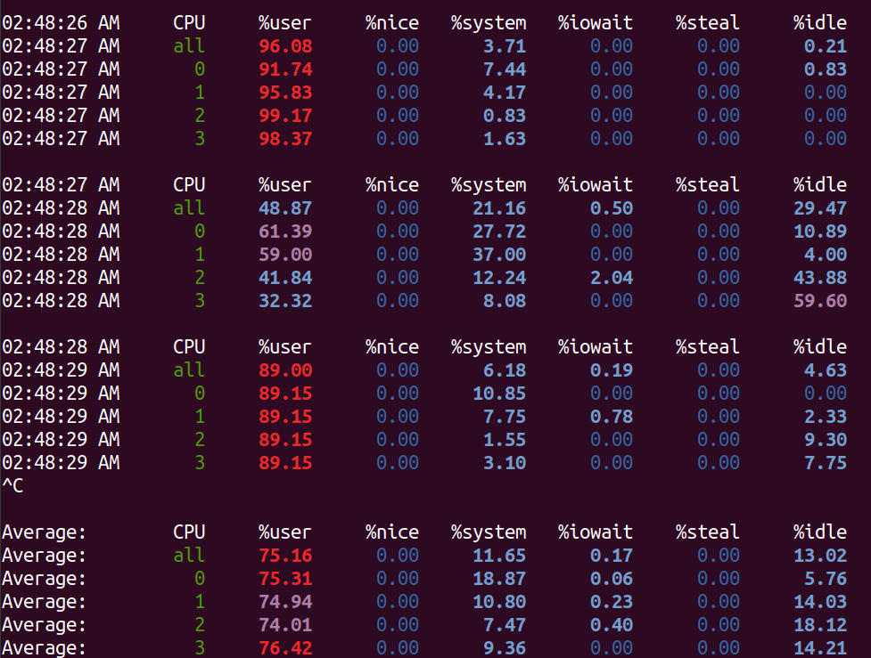
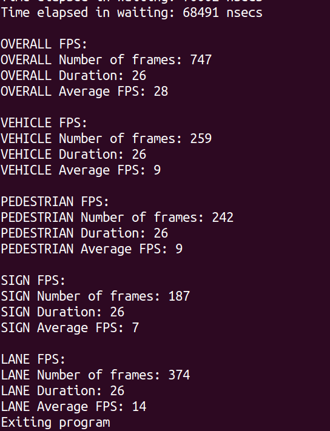
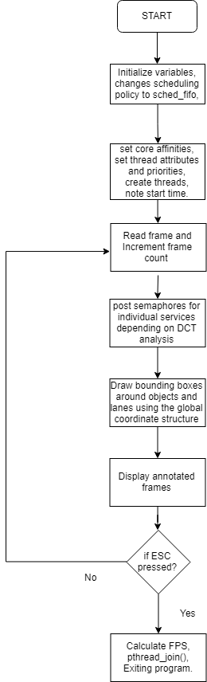

# Autonomous Vehicle Prototype System  

## Author: Siddhant Jajoo and Sarthak Jain. 

This project was completed in the course Embedded Machine Vision and Intelligent Automation at University of Colorado, Boulder under the guidance of Professor Sam Siewert in May 2019.
 
  
## Hardware and Software Components:
- Jetson Nano
- Linux
- Multithreading
- Thread Safety
- Monitoring CPU utilzation
- OpenCv
- Rate Monotonic Scheduling Policy
- Scheduler Thread
- Semaphores  

The following test images below show lane, vehicle, pedestrian and traffic signal detection obtained from the project code.

  
    
      
      
The following are the screenshots for the CPU utilization, overall and individual services FPS obtained depending on the DCT values. 

## Introduction

The Project consists of majorly 6 parts:  
1. Basic Structure 2. Scheduler 3. Lane Detection 4. Pedestrian Detection 5. Vehicle Detection 6. Traffic light Detection. 
 
The project was kicked off by building Land Detection and Pedestrian Detection functions by Siddhant and Sarthak respectively. After creating base working functions for lane and pedestrian, they were integrated into a single project. In order to make them work smoothly, a lot of factors had to be constantly adjusted and modified. The goals that had to be achieved were an acceptable FPS and correct detection of objects in question. Care had to be taken that the CPUs do not get overloaded and the system had to be robust. In addition to this, the design had to be such that it should be fail-safe and should work in even in worst-case situations. A failure of a single service should not affect the other ongoing services. For example: If in any case lane detection gets blocked at some point, the system should keep on functioning irrespective of the situation of other services. In order to achieve this, different methods were employed through the project development course such as use of semaphores and mutexes, different scheduling policies such as CFS and SCHED_FIFO, use of OpenCV, use of a scheduler and rate monotonic analysis. In order to get optimal results with the constraint of resources at hand, Haar cascade classifiers, HOG, Canny and Hough transforms, down and up conversion of images, resizing of images were used. We will discuss how the different parts of the project were implemented by looking at the functional diagram and the basic flow of the project. 
 
## Functional Block Diagram

 
The block diagram above is the projected functional design overview of the project. The project basically consists of 4 services – Lane Detection, Road Sign Detection which has been updated to detect traffic signals on roads, Vehicle Detection and Pedestrian Detection. The lane detection module would detect lanes and trigger a warning if it crosses a lane thus enabling the lane departure warning system with steering feedback. Vehicle Detection would detect the vehicles at the front in order to determine if it should decelerate or not based on the distance of the vehicle in front. Pedestrian Detection would detect any pedestrians on road and if present any, would trigger the vehicle to stop, slow down or continue at the current speed. The same is applied for road sign detection, if it detects a stop sign, the vehicle must stop. .An additional module was added to detect traffic lights. This would detect red lights on the streets and make decision to whether stop the car or not. 

## Sequencer Block Diagram:

The initial design for this project included just use of 5 semaphores in order to control the 4 services without using an sequencer. The idea was to post all the 4 services using a single semaphore from the main process as soon as a frame is read from the video. After several iterations, we came up with the functional block diagram of the sequencer above which increased our FPS drastically. The entire documentation of the sequencer can be found in the project report.  

## Challenges Faced:

1. Some of the problems that were faced during lane detection were:   
 a. One problem that was faced was that multiple lines were being detected for a single lane. This was solved by averaging all the coordinates obtained for that particular line and displaying the averaged line for the lane.  
 b. Another one was several horizontal lines were being detected since the mask was not accurate enough due to background noises and other objects and arrow signs on the roads. These were eliminated in the final result by keeping a filter of detecting only those lines that had a slope between 0.5 and -0.5. The slope also helped to bifurcate left and right lines in the frame. 

2. Numerous problems were faced while implementing the scheduler.  All the problems faced while implementing a scheduler have been described clearly in the scheduler section on page 7 in functional design overview section. 

3. The only challenge in Pedestrian Detection was to select the correct set of parameters in order to achieve accuracy as well higher FPS.   

## Conclusion and Future Scope

To conclude, we can state the results of our analysis. Implementing all four services with their assigned request rates gives an overall frame rate between **25-27**. This is, provided the main thread executes with a period of roughly 33 ms. Each service delivers an FPS as expected. 
Using a scheduler and changing the scheduling policy to FIFO drastically increased the frame rate. Preprocessing of the input image and using the right set of parameters in each individual service was paramount as well.  
For future submissions, a lane departure warning system can be implemented by building upon the current lane following system. Traffic sign recognition can be improved and made faster by removing false negatives, adding more road-signs and pre-processing the image respectively. Making the system smarter by detecting vehicles in adjacent lanes and accelerating/decelerating based on the distance between the vehicle in front and the car can be implemented.  
   
    
 The entire project analysis and documentation can be found [here]().
   
 The entire project code zip file can be found [here](https://github.com/jajoosiddhant/Embedded-Machine-Vision-And-Intelligent-Automation/blob/master/Project/Sarthak_Jain_%26_Siddhant_Jajoo_code.zip).  
   
 The project PPT can be found [here](https://github.com/jajoosiddhant/Embedded-Machine-Vision-And-Intelligent-Automation/blob/master/Project/Project%20Presentation.pptx).  
